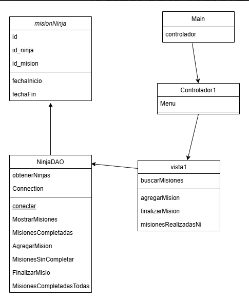

# Filtro_Java_MachucaCamilo
Se realizo un programa para manejar las misiones y datos de los ninjas para mejorar la eficiencia y la coordinacion entre los equipos.
## Diagrama de clases

## Descripción
El programa esta realizado con un menu que contiene las siguientes opciones:
1. Listar todos los ninjas junto con sus habilidades.
2. Mostrar las misiones disponibles para un ninja específico.
3. Mostrar las misiones completadas para un ninja específico.
4. Asignar una misión a un ninja, registrando la fecha de inicio.
5. Marcar una misión como completada, registrando la fecha de finalización.
6. Mostrar todas las misiones completadas (funcionalidad descrita en el apartado de archivos de texto).

## Requisitos del sistema
- Tener NetBeans
- Tener mysql-connector-j-9.2.0

## Tecnologías utilizadas
- Java
- MySQL
- Clever cloud

## Instalación y Configuración
- El archivo **Java_ProyectoFiltro:** Contiene el codigo fuente del programa.
- El archivo **INSERT_Filtro:** Contiene las inserciones de la base de datos.
- El archivo **SQL_DATABASE_Filtro:** Contiene la creación de la base de datos.
- El Readme **Readme:** Contiene la información del proyecto.

## Instrucciones de uso
1. Debes tener instalada la aplicación de NetBeans 18.
2. Clonar el repositorio y abrirlo en un servicio compatible.

```bash
git clone https://github.com/CamiloMachuca/Filtro_Java_MachucaCamilo.git
``` 
3. Abrir el repositorio en NetBeans.
4. Ejecutar el programa Main que se encuentra en la carpeta Java_ProyectoFiltro.

## Estructura del proyecto 


## Desarrollado por
Este programa fue desarrollado por Camilo Machuca Vega.