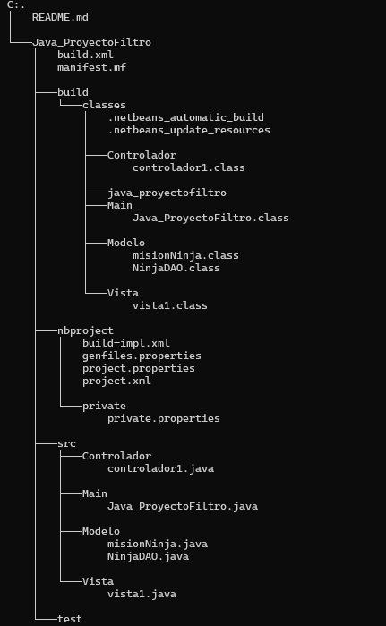

# Filtro_Java_MachucaCamilo
Se realizo un programa para manejar las misiones y datos de los ninjas para mejorar la eficiencia y la coordinacion entre los equipos.

## Descripción
El programa esta realizado con un menu que conetien las siguientes opciones:
1. Listar todos los ninjas junto con sus habilidades.
2. Mostrar las misiones disponibles para un ninja específico.
3. Mostrar las misiones completadas para un ninja específico.
4. Asignar una misión a un ninja, registrando la fecha de inicio.
5. Marcar una misión como completada, registrando la fecha de finalización.
6. Mostrar todas las misiones completadas (funcionalidad descrita en el apartado de archivos de texto).

## Tecnologias utilizadas
- Java
- MySQL
- Clever cloud
## Estructura del proyecto 

## Desarrollado por
Este programa fue desarrollado por Camilo Machuca Vega.